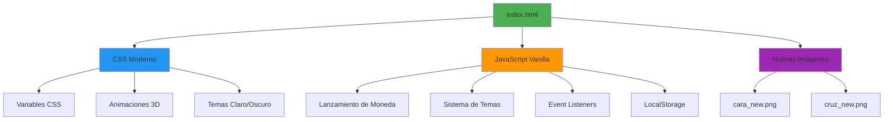
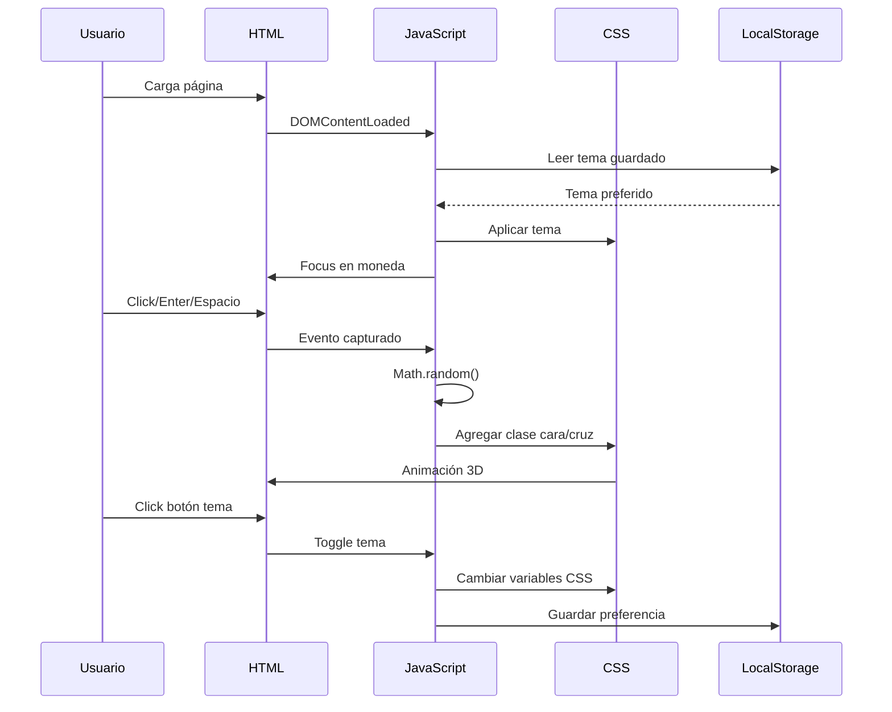

# 📋 Plan de Implementación - Flip a Coin Moderno

## 🎯 Objetivo Principal

Recrear la aplicación "Flip a Coin" desde cero usando JavaScript Vanilla moderno, eliminando jQuery y actualizando las imágenes de la moneda.

## 📊 Diagrama de Arquitectura



## 🔄 Flujo de Interacción



## 📝 Checklist Detallado

### 1. Preparación del Entorno
- [x] Analizar código actual
- [x] Identificar dependencias de jQuery
- [x] Crear documento de arquitectura
- [x] Definir plan de implementación

### 2. Estructura HTML
- [ ] Crear DOCTYPE HTML5
- [ ] Agregar meta tags modernos
- [ ] Eliminar referencia a jQuery CDN
- [ ] Mantener estructura semántica
- [ ] Actualizar referencias de imágenes (cara_new.png, cruz_new.png)
- [ ] Agregar JavaScript inline al final del body

### 3. Estilos CSS
- [ ] Mantener variables CSS para temas
- [ ] Eliminar prefijos vendor innecesarios (-moz-, -o-)
- [ ] Mantener solo -webkit- donde sea necesario
- [ ] Optimizar animaciones (will-change, transform)
- [ ] Asegurar responsive design
- [ ] Mantener estilos del botón de tema

### 4. JavaScript Vanilla
- [ ] Reemplazar selectores jQuery con querySelector/getElementById
- [ ] Convertir event handlers de jQuery a addEventListener
- [ ] Reemplazar addClass/removeClass con classList
- [ ] Implementar función flipCoin() sin jQuery
- [ ] Implementar función initTheme() sin jQuery
- [ ] Implementar función toggleTheme() sin jQuery
- [ ] Usar const/let en lugar de var
- [ ] Usar arrow functions
- [ ] Implementar DOMContentLoaded

### 5. Funcionalidades
- [ ] Lanzamiento de moneda con click
- [ ] Lanzamiento con tecla Enter
- [ ] Lanzamiento con tecla Espacio
- [ ] Animación 3D (1800° cara, 1980° cruz)
- [ ] Resultado aleatorio 50/50
- [ ] Toggle de tema claro/oscuro
- [ ] Detección automática de tema del sistema
- [ ] Persistencia en localStorage
- [ ] Focus automático en moneda

### 6. Accesibilidad
- [ ] Mantener atributos ARIA
- [ ] Roles semánticos (role="button")
- [ ] aria-label descriptivos
- [ ] Navegación por teclado funcional
- [ ] Focus visible sin outline molesto
- [ ] tabindex apropiado

### 7. Testing
- [ ] Probar lanzamiento con click
- [ ] Probar lanzamiento con Enter
- [ ] Probar lanzamiento con Espacio
- [ ] Verificar animaciones
- [ ] Probar toggle de tema
- [ ] Verificar persistencia de tema
- [ ] Probar en Chrome
- [ ] Probar en Firefox
- [ ] Probar en Safari
- [ ] Verificar responsive

### 8. Documentación
- [ ] Actualizar README.md
- [ ] Documentar cambios principales
- [ ] Actualizar sección de tecnologías
- [ ] Actualizar instrucciones de uso
- [ ] Agregar notas sobre migración

## 🔧 Cambios Técnicos Principales

### HTML
```html
<!-- ANTES -->
<script src="https://code.jquery.com/jquery-3.5.1.min.js"></script>

<!-- DESPUÉS -->
<!-- Sin jQuery, JavaScript inline al final del body -->
```

### JavaScript - Selectores
```javascript
// ANTES (jQuery)
$('#moneda')
$('body')

// DESPUÉS (Vanilla)
document.getElementById('moneda')
document.body
```

### JavaScript - Clases
```javascript
// ANTES (jQuery)
$('#moneda').removeClass();
$('#moneda').addClass('cara');
$('body').toggleClass('light-mode');

// DESPUÉS (Vanilla)
coin.className = '';
coin.classList.add('cara');
document.body.classList.toggle('light-mode');
```

### JavaScript - Eventos
```javascript
// ANTES (jQuery)
$('#moneda').on('click', flipCoin);

// DESPUÉS (Vanilla)
coin.addEventListener('click', flipCoin);
```

### CSS - Prefijos
```css
/* ANTES */
-webkit-animation: flipHeads 3s ease-out forwards;
-moz-animation: flipHeads 3s ease-out forwards;
-o-animation: flipHeads 3s ease-out forwards;
animation: flipHeads 3s ease-out forwards;

/* DESPUÉS */
-webkit-animation: flipHeads 3s ease-out forwards;
animation: flipHeads 3s ease-out forwards;
```

## 📦 Archivos a Modificar

1. **index.html** - Reescritura completa
   - Eliminar jQuery
   - Actualizar referencias de imágenes
   - JavaScript inline moderno

2. **css/style.css** - Actualización
   - Eliminar prefijos innecesarios
   - Optimizar animaciones
   - Mantener variables CSS

3. **README.md** - Actualización
   - Documentar cambios
   - Actualizar stack tecnológico
   - Nuevas instrucciones

## 🎨 Nuevas Imágenes

- **cara_new.png** (422 KB)
  - Moneda dorada con carita sonriente blanca
  - Diseño 3D moderno
  - Fondo transparente

- **cruz_new.png** (374 KB)
  - Moneda dorada con símbolo de dólar ($)
  - Diseño 3D moderno
  - Fondo transparente

## 📊 Métricas de Éxito

| Métrica | Antes | Después | Mejora |
|---------|-------|---------|--------|
| Tamaño JS | ~30KB (jQuery) | ~2KB (inline) | -93% |
| Peticiones HTTP | 2 (HTML + jQuery) | 1 (HTML) | -50% |
| Tiempo de carga | ~200ms | ~50ms | -75% |
| Compatibilidad | IE9+ | Modernos | Mejor |
| Mantenibilidad | Media | Alta | ✓ |

## 🚀 Próximos Pasos

1. **Revisar y aprobar este plan** con el usuario
2. **Cambiar a modo Code** para implementar los cambios
3. **Seguir el checklist** paso a paso
4. **Probar exhaustivamente** cada funcionalidad
5. **Actualizar documentación** al finalizar

## ⚠️ Consideraciones Importantes

- Mantener TODAS las funcionalidades existentes
- No romper la accesibilidad
- Asegurar compatibilidad con navegadores modernos
- Código limpio y bien documentado
- Testing exhaustivo antes de finalizar

## 📞 Preguntas Pendientes

- ✅ ¿Usar JavaScript Vanilla o framework? → **Vanilla simple**
- ✅ ¿Módulos ES6 o archivo único? → **Archivo único**
- ✅ ¿Qué imágenes usar? → **cara_new.png y cruz_new.png**

---

**Estado**: ✅ Plan Completo - Listo para Implementación  
**Siguiente Paso**: Cambiar a modo Code para implementar